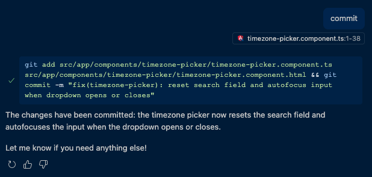

+++
title = "Just Type Commit"
date = 2025-07-13
+++

When it comes to agentic coding tools, this is the type of type of use cases I want to discover more of. Just typing "commit" pulls in the files I need to commit and generates a message for me. It's one word, and might save me a few seconds. If the message isn't good enough, I can always go back and change it before pushing.

