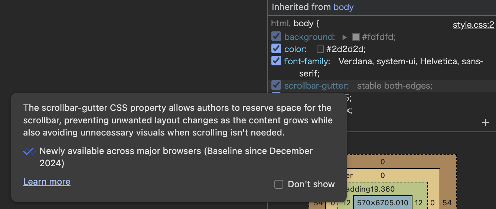

+++
title = "TIL: Baseline, the web compability database"
date = 2026-02-08

[extra]
link = "https://web.dev/baseline"
+++

> Baseline gives you clear information about which web platform features are ready to use in your projects today. When reading an article, or choosing a library for your project, if the features used are all part of Baseline, you can trust the level of browser compatibility.
> 
> Baseline has two stages:
> 
> **Newly available**: The feature is supported by all of the core browsers, and is therefore interoperable.
>
> **Widely available**: 30 months have passed since the newly interoperable date. The feature can be used by most sites without worrying about support.
> 
> Prior to being Newly available, a feature has **Limited availability** when it's not yet supported across browsers.

Baseline status is built into Chrome Dev Tools as well. Hovering over a CSS selector shows this popup:

